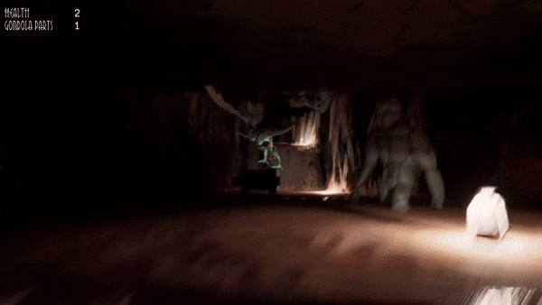
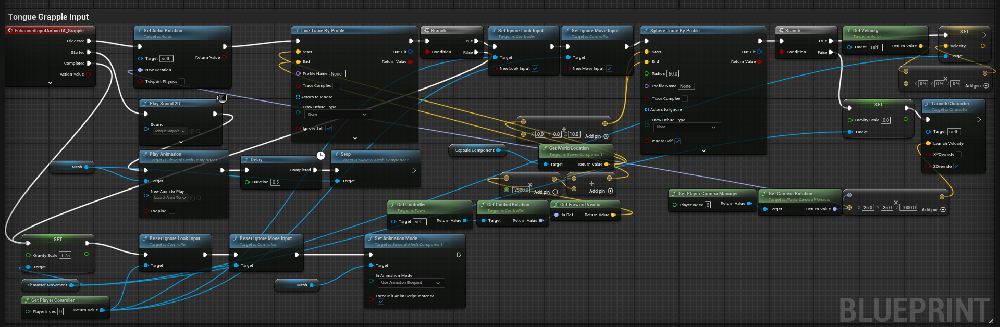
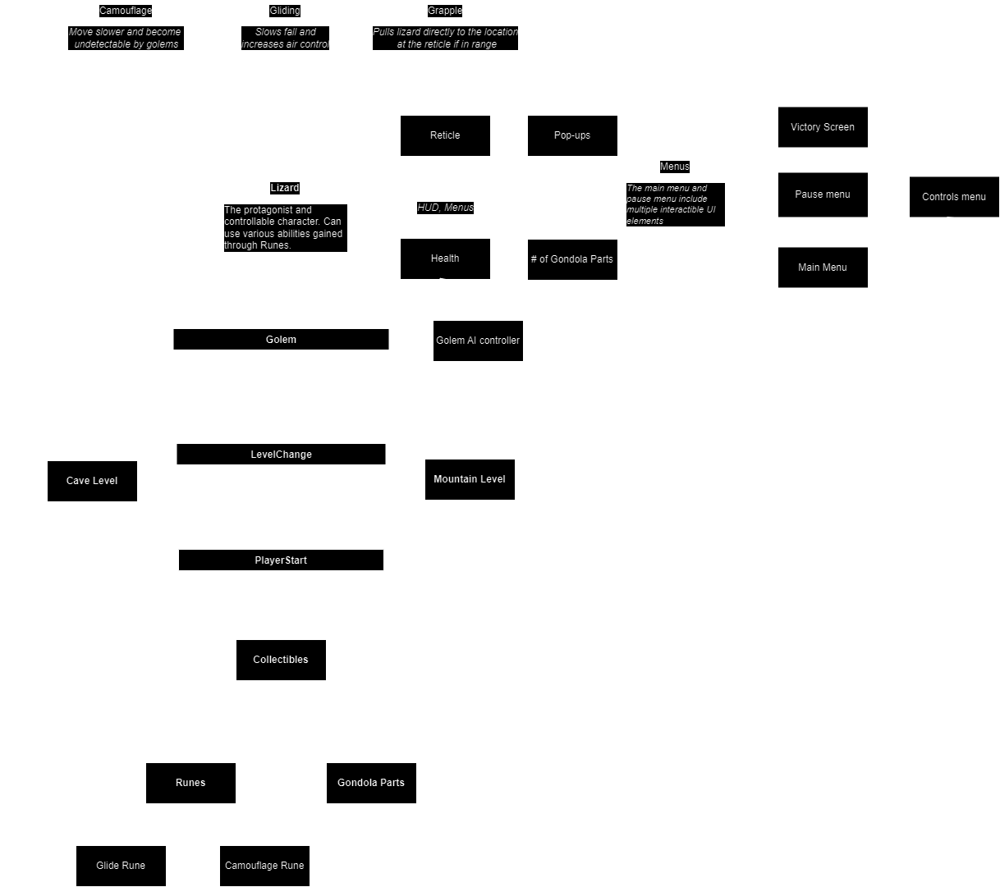

<head>
    <link rel="stylesheet" type="text/css" href="style.css"/>
    <meta name="viewport" content="width=device-width, user-scalable=no" />
</head>

# Scaling the Summit

Scaling the Summit is a third-person platformer where you play as a baby lizard trying to get off of a mountain by fixing a gondola in an abandoned village. Starting from deep within a cave, you must collect gondola parts, avoid golems, and find runes to unlock abilities inspired by real lizards. I was one of three programmers on the six person team developing this game, made using Unreal Engine 5 with Blueprints in seven weeks.

## Contributions:
My main role in the project was to implement the gameplay mechanics of the lizard. Since Unreal already has a highly editable Blueprint template for a third person character, this meant I focused on the special abilities the lizard would have and the runes that would unlock them. The three abilities include a tongue grapple,

a toggleable glide,

and camouflage to avoid the enemy golems.

I was also responsible for integrating most of the art assets into the game, including working on blend spaces and animation Blueprints for the lizard and golem. I added several quality of life changes and other minor additions such as the ending sequence, level transistions, and parts of the UI. I also helped with merging different versions of the game and fixing merge conflicts that came with it.

## Challenges:
The biggest challenge I faced by far was implementing the grapple ability. Since our team wanted to make interesting controls, my idea for the grapple involved holding down the left mouse button to grapple to the location the lizard is looking at, and being able to release the button while grappling to preserve momentum. This complicated things a lot, but a combination of camera rotation, launch character, some gravity and velocity overrides, and Unreal's EnhancedInputAction system gave me a solid result. Unfortunately, this created a new issue of being able to fly anywhere. I fixed this by locking the camera and movement while grappling, doing a line trace from the lizard's position to add a maximum range, and doing a sphere trace that let the lizard stick to surfaces instead of sliding across them unnaturally. The final iteration of the lizard Blueprint had a grappling section that looked like this:

Another challenge I had was getting the animations to work with Blueprints and blend spaces. The art team helped me set these up, but some animations ended up being hard to implement this way. Eventually, I was able to get those animations playing manually through event calls and could still integrate them with the blend space animations. All of the challenges I faced, even the ones too small to mention here, were amplified by this being my first experience with Unreal. Despite the harsh learning curve and the large amount of trial and error I went through to learn, I found Blueprints to be intuitive and only made finding online resources simpler.

## Architectural Diagrams
### Overall Structure

### Lizard Mechanics Structure

## Version Control:

Version control might have been the hardest part of our entire development. Our team started with Git LFS and intended to use Github Desktop despite our art team's inexperience with it. However, we quickly ran into issues with file sizes and merging, so we temporarily switched to using the art team's Google Drive while we worked out a solution. Unfortunately, development continued quickly with no signs of a solution, so we were forced to continue using Google Drive for the remainder of development. The only real benefit this brought was that it eliminated most merge conflicts and was fundamentally simpler than Github. The most obvious downside was the massive upload and download times, especially with the growing project size. The other big downside was that files had to be manually merged or transferred into the main project, which is what I ended up being in charge of. It could take several hours just for me to download a separate project file, add some of my teammate's changes, and reupload the new project file. This limited the amount of work everyone could do at the same time, and overall was a terrible experience that I hope to never do again.

## Lessons Learned:
The most important lesson I learned was how to communicate and work with a larger team on a large-scale game. While learning Unreal and Blueprints was important, most of that involved trial and error and online resources, which isn't figured out the same way team coordination is. However, I would still say that figuring out Blueprints is pivotal to anyone new to Unreal, since they can be used in almost any scenario. Another important lesson was to realize when features needed to be refined and where. While I kept adding on to the mechanics I made until I was satisfied, playtesting brought up completely new issues and ideas I hadn't thought of. Accepting criticism ultimately led to a better result. I also learned just how bad Google Drive is for version control, but figured out that manually merging doesn't have many issues if you want to do it as a last resort.
